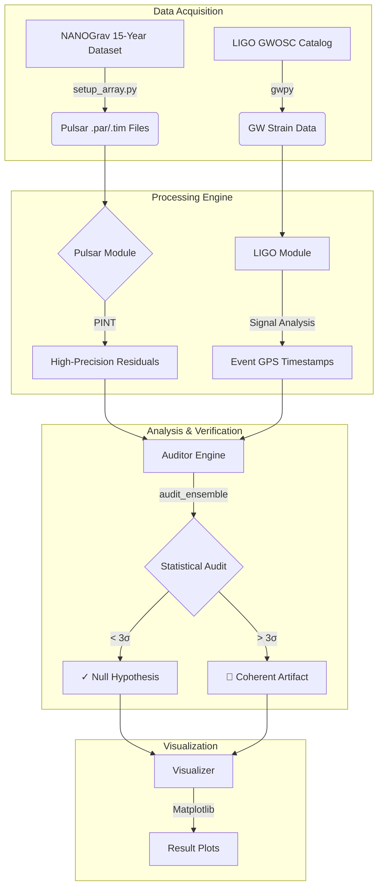

<p align="center">
  <h1 align="center">🔭 Demiurge Trace</h1>
  <p align="center">
    <strong>A high-precision astrophysical auditing tool for testing the Simulation Hypothesis.</strong>
  </p>
  <p align="center">
    Correlates LIGO/Virgo/KAGRA gravitational wave events with sub-microsecond pulsar timing residuals<br/>
    from the NANOGrav 15-year dataset to search for coherent "simulation lag" artifacts.
  </p>
</p>

<p align="center">
  <a href="https://www.python.org/downloads/"></a>
  <a href="https://gwosc.org/"></a>
  <a href="https://nanograv.org/"></a>
  <a href="https://github.com/nanograv/PINT"></a>
  <a href="https://gwpy.github.io/"></a>
</p>

---

## Table of Contents

- [Overview](#overview)
- [The Hypothesis](#the-hypothesis)
- [Architecture](#architecture)
- [Getting Started](#getting-started)
  - [Prerequisites](#prerequisites)
  - [Installation](#installation)
  - [Data Setup](#data-setup)
- [Usage](#usage)
  - [Ensemble Audit](#ensemble-audit)
  - [Single Pulsar Audit](#single-pulsar-audit)
  - [Simulation Mode](#simulation-mode)
  - [CLI Reference](#cli-reference)
- [Project Structure](#project-structure)
- [Scientific Details](#scientific-details)
- [Contributing](#contributing)
- [License](#license)
- [Disclaimer](#disclaimer)

---

## Overview

**Demiurge Trace** bridges two domains of astrophysics:

- **High-energy physics** — Confirmed gravitational wave merger events detected by LIGO/Virgo/KAGRA.
- **Precision timing** — Sub-microsecond timing residuals from millisecond pulsars (MSPs) in the NANOGrav 15-year dataset.

The tool performs a statistical audit to determine whether coherent timing anomalies appear across a pulsar array during gravitational wave events — a signature that would be consistent with computational "lag" in a simulated universe.

---

## The Hypothesis

If our universe operates on finite computational resources, extremely high-load events — such as binary neutron star or black hole mergers — could theoretically produce measurable "simulation lag." This lag would manifest as a coherent, synchronized timing deviation across the galaxy's most stable natural clocks: millisecond pulsars.

A genuine simulation artifact would be:

1. **Temporally Correlated** — Occurring precisely within the GW merger event window.
2. **Spatially Invariant** — Affecting the entire observable pulsar array simultaneously, regardless of sky position.

Unlike individual pulsar jitter or instrumentation noise, a coherent artifact would stand out as a statistically significant ensemble-wide deviation.

---

## Architecture

The system is built as a modular pipeline with four stages:



---

## Getting Started

### Prerequisites

| Dependency | Purpose |
|:---|:---|
| [Python 3.9+](https://www.python.org/downloads/) | Runtime |
| [PINT](https://github.com/nanograv/PINT) | Pulsar timing model loading & residual calculation |
| [GWpy](https://gwpy.github.io/) | LIGO/GWOSC data access & strain retrieval |
| [Matplotlib](https://matplotlib.org/) | Visualization |
| [Astropy](https://www.astropy.org/) | Time coordinate transformations (GPS ↔ MJD/TDB) |

### Installation

```bash
# Clone the repository
git clone https://github.com/ericmaddox/demiurge-trace.git
cd demiurge-trace

# Create and activate a virtual environment
python -m venv .venv

# Linux / macOS
source .venv/bin/activate

# Windows
.\.venv\Scripts\activate

# Install dependencies
pip install pint-pulsar gwpy matplotlib numpy requests dash plotly
```

### Data Setup

The auditor requires real millisecond pulsar timing data. Run the setup script to automatically download, extract, and patch the NANOGrav 15-year narrowband dataset from Zenodo:

```bash
python setup_array.py
```

This script handles:
- Downloading the dataset tarball (~600 MB) from [Zenodo Record 8423265](https://zenodo.org/records/8423265)
- Extracting `.par` and `.tim` files for the target pulsar ensemble
- Patching binary model parameters for PINT compatibility (e.g., `T2` → `DDK`)

Data is saved to `data/real/`.

---

## Usage

### Ensemble Audit

Run the full pulsar array audit against a specific gravitational wave event:

```bash
python main.py --event GW170817 --ensemble --window 432000 --output results/audit_GW170817.png
```

> **Note:** A window of `432000` seconds (5 days) is recommended to account for the sparse cadence of pulsar timing array observations.

### Single Pulsar Audit

Audit a single pulsar against an event:

```bash
python main.py --event GW150914 --pulsar J1713+0747
```

### Simulation Mode

Inject a synthetic 10 µs lag spike across the ensemble to validate detection sensitivity:

```bash
python main.py --event GW170817 --ensemble --simulate-lag --output results/sim_detection.png
```

### Interactive Dashboard

Launch the web-based Plotly Dash dashboard for interactive exploration:

```bash
python dashboard.py
```

Open [http://127.0.0.1:8050](http://127.0.0.1:8050) in your browser. Features include:
- **Event & window selection** with real-time re-analysis
- **Interactive Plotly charts** with zoom, pan, and hover tooltips
- **Per-pulsar deep dives** with window-highlighted residuals
- **Results table** with color-coded sigma deviations

### CLI Reference

```
usage: main.py [-h] [--event EVENT] [--pulsar PULSAR] [--ensemble]
               [--window WINDOW] [--simulate-lag] [--output OUTPUT]

Demiurge Trace — Simulation Hypothesis Auditor

options:
  --event EVENT         GW event name (default: GW150914)
  --pulsar PULSAR       Pulsar name for single-pulsar mode (default: J1713+0747)
  --ensemble            Run audit on the entire pulsar array
  --window WINDOW       Analysis window in seconds (default: 86400)
  --simulate-lag        Inject a synthetic lag spike for testing
  --output OUTPUT       Output plot filename (default: audit_result.png)
```

---

## Project Structure

```
demiurge-trace/
├── main.py                  # CLI entry point
├── dashboard.py             # Interactive Plotly Dash web dashboard
├── setup_array.py           # NANOGrav data acquisition & patching
├── setup_data.py            # Alternative data setup utilities
├── get_data_urls.py         # Zenodo URL resolver
├── demiurge_trace/          # Core library
│   ├── __init__.py
│   ├── ligo_module.py       # GW event lookup & strain data fetching
│   ├── pulsar_module.py     # PINT model loading & residual calculation
│   ├── auditor.py           # Statistical audit engine (single + ensemble)
│   └── visualizer.py        # Matplotlib plotting (single + ensemble)
├── data/
│   └── real/                # NANOGrav .par/.tim files (generated by setup)
├── results/                 # Output plots
└── tools/                   # Diagnostic & debugging utilities
```

---

## Scientific Details

### Timing Precision

- **Planetary Shapiro Correction:** TOAs are loaded with `planets=True` to include Solar System ephemeris data (DE421), essential for sub-microsecond residual accuracy.
- **BIPM Clock Corrections:** Observatory clock corrections are applied using the latest BIPM2023 timescale.

### Time Coordinate Alignment

All LIGO timestamps (GPS) are synchronized with pulsar timing coordinates (MJD/TDB) using `astropy.time`, maintaining sub-millisecond alignment across the two data domains.

### Model Compatibility

The data setup pipeline includes an automated patching layer to handle non-standard NANOGrav parameter names and binary models (e.g., `T2` → `DDK` conversion) for full PINT compatibility.

### Statistical Method

The auditor computes timing residual RMS within a configurable window around each GW event and compares it against the baseline RMS distribution. An ensemble-wide sigma score is derived by averaging individual pulsar deviations. A coherent artifact is flagged when:

- The ensemble sigma exceeds **3.0σ**, or
- Three or more pulsars simultaneously exceed **1.0σ** (in arrays of ≥ 5 pulsars)

### Pulsar Ensemble

| Pulsar | Type | Notes |
|:---|:---|:---|
| J1713+0747 | MSP | DDK binary model |
| J1909-3744 | MSP | High-precision timing standard |
| J0437-4715 | MSP | Closest and brightest MSP |
| J1614-2230 | MSP | Massive neutron star |
| J1744-1134 | MSP | Isolated MSP |
| B1937+21 | MSP | Original millisecond pulsar |
| B1855+09 | MSP | Long timing baseline |
| J1600-3053 | MSP | Wideband timing target |
| J2145-0750 | MSP | Southern sky pulsar |
| J1857+0943 | MSP | NANOGrav array member |

---

## Contributing

Contributions are welcome! Here are some areas where help is needed:

- **Multi-event sweep** — Automate auditing across the full GWOSC catalog
- **Monte Carlo significance testing** — Bootstrap p-values for stronger statistics
- **Cross-correlation analysis** — Pairwise pulsar residual correlations (Hellings-Downs style)
- **Interactive dashboard** — Plotly/Streamlit visualization
- **Additional PTA data** — EPTA, PPTA, and IPTA integration

To contribute:

1. Fork the repository
2. Create a feature branch (`git checkout -b feature/your-feature`)
3. Commit your changes (`git commit -m "Add your feature"`)
4. Push to the branch (`git push origin feature/your-feature`)
5. Open a Pull Request

---

## License

This project is currently unlicensed. See [choosealicense.com](https://choosealicense.com/) to select an appropriate open-source license.

---

## Disclaimer

This project is an experimental tool for testing the limits of astrophysical data in the context of the Simulation Hypothesis. It is **not** intended as a proof of simulation, but as a rigorous statistical audit of physical consistency using real observational data.
